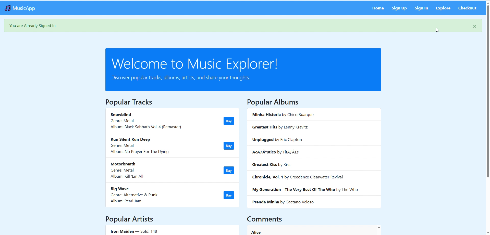
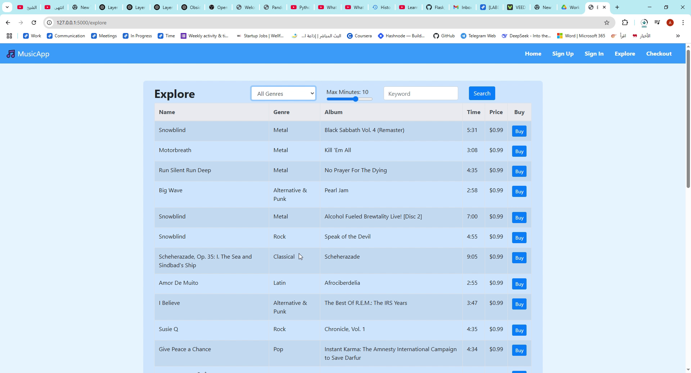
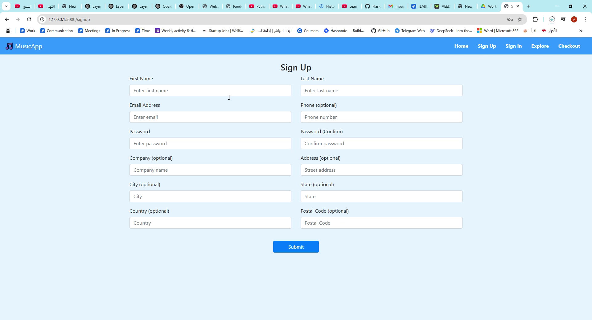

# 🎵 Music Web App – RESTful & GraphQL Comparison

This project demonstrates a **full-stack music web application** implemented in **Flask**, showcasing two different API designs:

- **RESTful API**  
- **GraphQL API**  

The goal is to **compare REST and GraphQL approaches** in handling music data, including songs, artists, and playlists. The app allows users to explore how the same data can be fetched, updated, and displayed using different backend strategies.

---

## 📝 Overview

Key features and concepts:

- Dynamic web pages using Flask templates  
- Backend interaction with both RESTful and GraphQL endpoints  
- CRUD operations for songs, artists, and playlists  
- Performance and usability comparison between REST and GraphQL  
- Example datasets included for testing  
- Focus on understanding API design patterns in a real application  

---

## 🎬 Demo Video

Click the image below to watch the full demo video showing all interactions in the app:  

  
*Figure: Demo video showcasing the Music Web App functionality*

---

## ⚙️ Project Structure

| Path | Description |
|------|-------------|
| `Code/3.Comparing_RESTFUL_GraphQL/Music_Website/1.Version_Scratch/` | Core Flask web app (REST + GraphQL) |
| `assests/` | Screenshots, demo thumbnail, and other visual assets |
| `requirements.txt` | Python dependencies |
| `README.md` | Project documentation |
| `utils/` | Helper functions for backend logic |
| `notebooks/` | Optional experimentation or testing scripts |

---

## 🖼 Screenshots

  
  

  
  

**Figure Descriptions:**  

- `homepage_screenshot.png` – Main homepage of the app  
- `song_list_graphql.png` – Song list fetched via GraphQL API  
- `song_detail_rest.png` – Song detail page using REST API  
- `playlist_creation.png` – Playlist creation feature  

---

## 🔧 Features

- **REST API Implementation** – Standard CRUD operations for songs, artists, and playlists  
- **GraphQL API Implementation** – Flexible queries to fetch only required fields  
- **Flask Frontend Templates** – Dynamic HTML pages showing music data  
- **Interactive UI** – Users can view, add, update, and delete music content  
- **Comparison** – Highlights differences in performance, flexibility, and complexity between REST and GraphQL  

---

## 📄 Notes

- This is a **scratch version** demonstrating functionality and concepts  
- Backend and frontend logic can be further enhanced for production-level deployment  
- Demo video showcases **all key interactions** with the app  
- Focus is on comparing **REST vs GraphQL**, including API flexibility, query efficiency, and user interaction  
